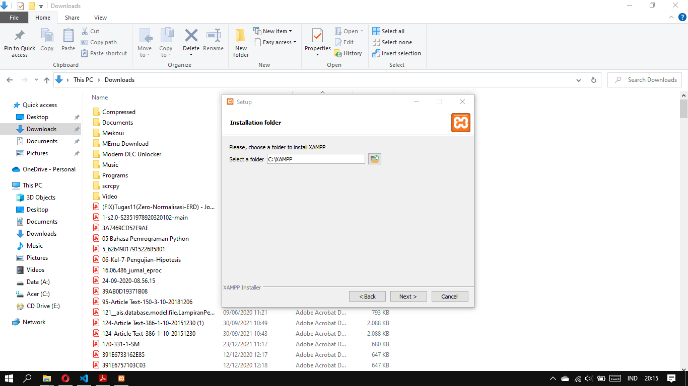
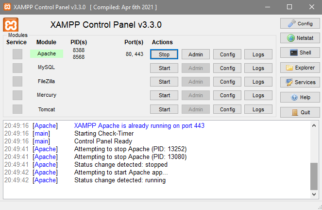
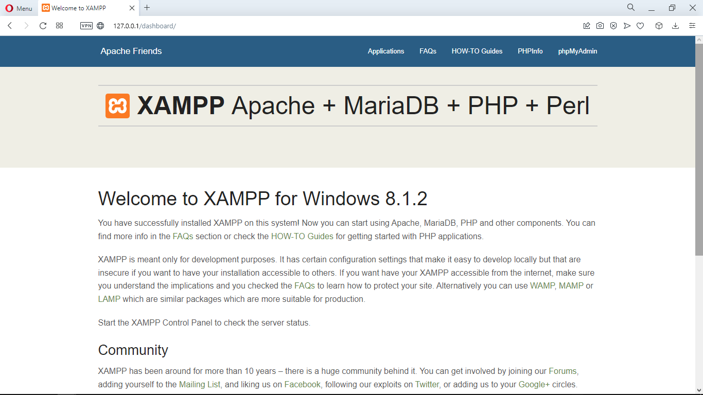
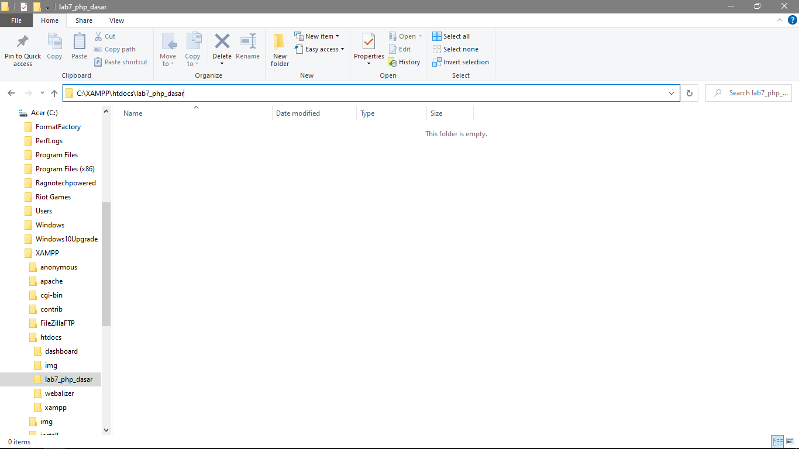
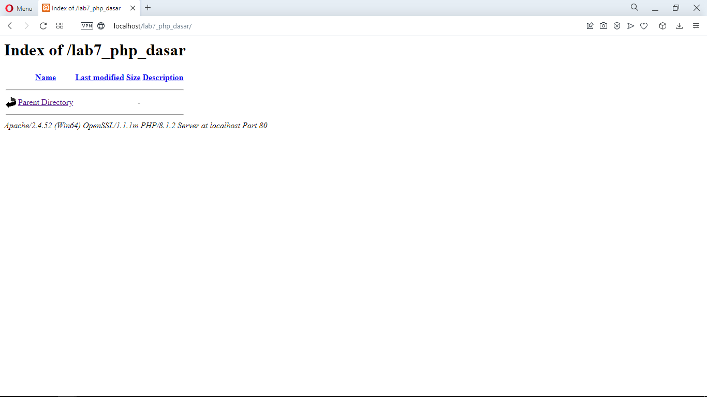
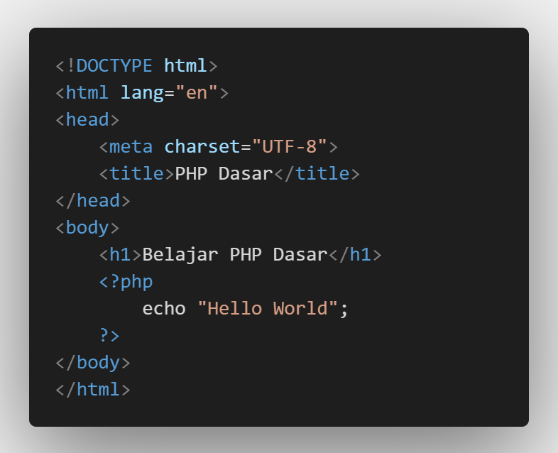
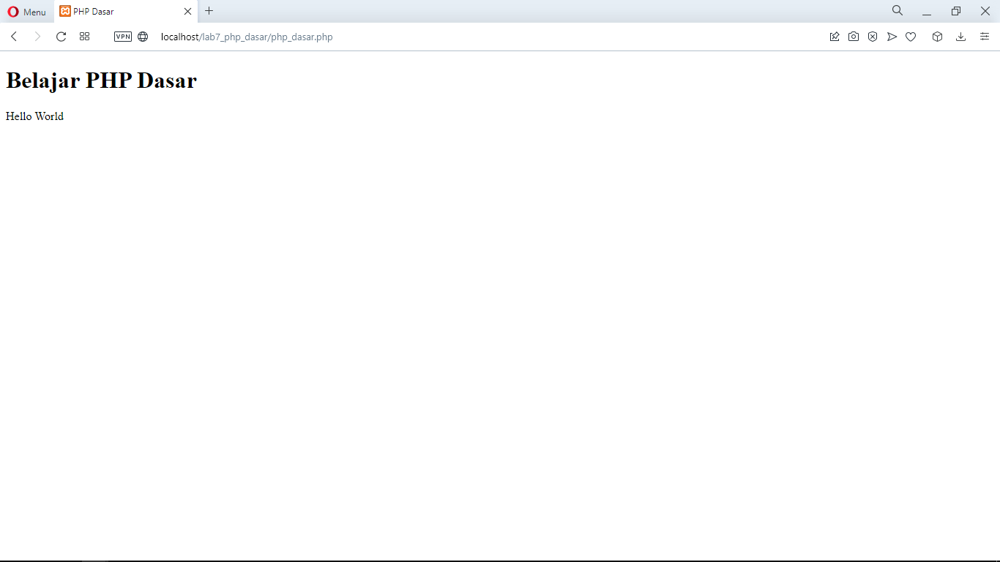
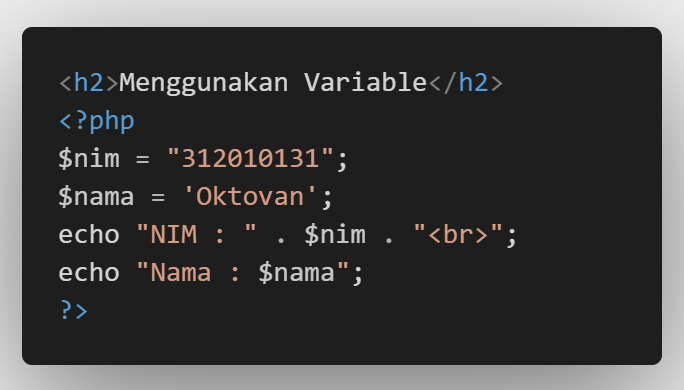
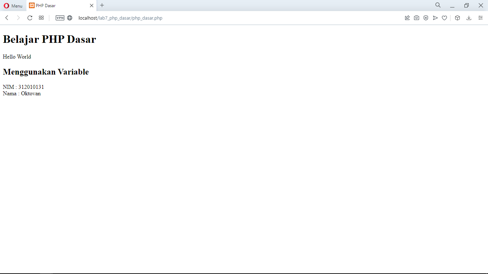

| Nama  | Oktovan Agung Shailendra|
|-------|-------------------------|
|NIM    |312010131                |
| Kelas | TI.20.A.1               |

---

# Langkah-Langkah Praktikum

## Persiapan
Untuk memulai membua kode PHP,perlu disiapkan web server dan interpreter PHP terlebih dahulu. Web server yang akan saya gunakan adalah Apache 2 dan interpreter PHP 7. Untuk memudahkan proses praktikum, saya akan menggunakan aplikasi bundle web server yaitu **XAMPP**

## Unduh & Install XAMPP
Unduh  XAMPP dari `https://www.apachefriends.org/download.html`, kemudian pilih versi sesuai dengan device yang digunakan, disini saya menggunkana windows. Setelah selesai download buka file tersebut untuk menginstall, dan sesuaikan direktorinya (misal : **c:\xampp**). Lalu tunggu hingga proses instalasi selesai.

## Konfigurasi Web Server
- **Konigurasi Apache**

Untuk konfigurasi HTTP server, seperti port yang digunakan akses HTTP, modul yang diaktifkan, lokasi document root, dll.
Lokasi file **\xampp\apache\conf\httpd.conf**

- **Konfigurasi PHP**

Untuk konfigurasi perilaku engine PHP yang berefek pada keamanan dan performa. Seperti batas maksimal waktu eksekusi script, batas file yang diupload, error reporting, dll.
Lokasi file : **\xampp\php\php.ini**

- **Konfigurasi MySql**

Konfigurasi server MySql, seperti administrator user, port, timezone, dll.
Lokasi file : **\xampp\mysql\bin\my.ini**

## Menjalankan Web Server
Untuk menjalankan web server dari menu XAMPP control.

- Uji coba apakah server sudah bekerja dengan baik `http://127.0.0.1` atau `http:localhouse`

Tampil halaman utama XAMPP jika server sudah bekerja dengan baik.

- Dokumen Website

Semua file website tempatkan di direktori : **\xampp\mysql**

- Database MySql

Direktori : **\xampp\mysql**
Manajemen database : `http://localhost/phpmyadmin`.

## Memulai PHP
BUat folder **lab7_php_dasar** pada root directory web server (**c:\xampp\htdoc**)

Kemudian untuk mengakses direktory tersebut pada web server dengan mengakses URL : `http://localhost/lab7_php_dasar/`

## PHP Dasar
Buat file baru dengan nama **php_dasar.php** pada directory tersebut. Kemudian buat kode seperti berikut.

Kemudian untuk mengakses hasilnya melalui URL : `http://localhost/lab7_php_dasar/php_dasar.php`

## Variable PHP
Menambahkan variable pada program.

